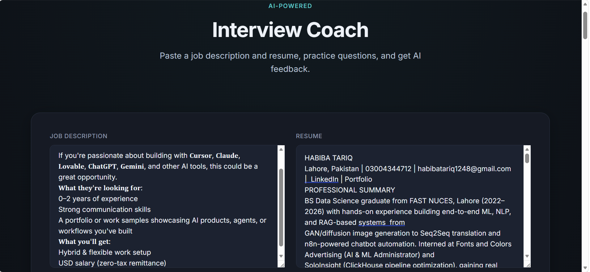
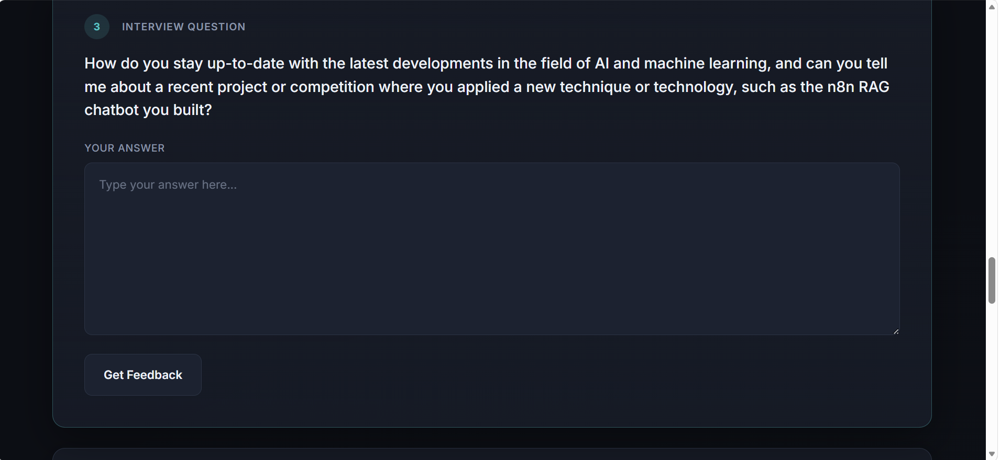
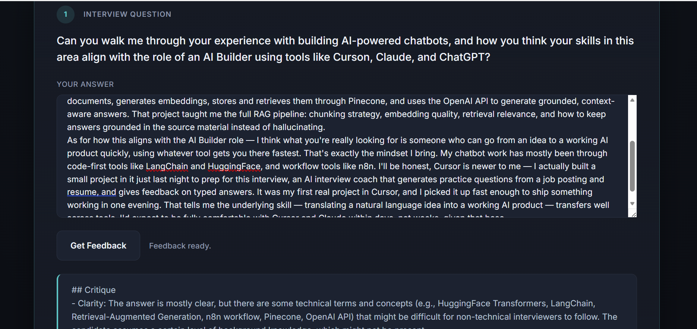
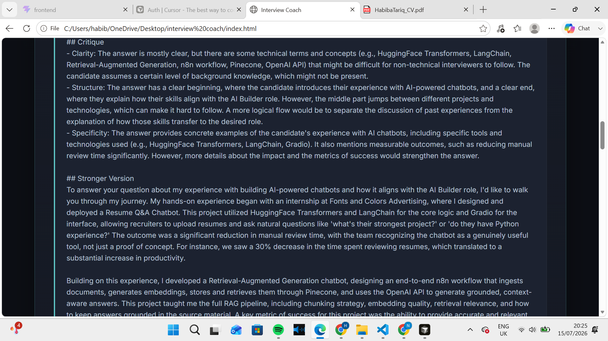

# Interview Coach 🎯

An AI-powered interview preparation tool that generates realistic interview questions from a job description and resume, then gives instant feedback on your typed answers  helping you walk into interviews more prepared.

Built in a single evening as a hands-on demo of rapid AI product development using **Cursor**.

## 💡 Why I Built This

Built in a single evening to demonstrate how quickly a working AI product can go from idea to demo using modern AI-assisted development tools. It doubles as a practical example of the exact workflow it's designed to help with  preparing for a technical interview.

## ✨ Features

- **Paste & Generate** — Paste in any job description and resume, and the app generates 5–6 realistic, role-specific interview questions.
- **Practice Answers** — Type your answer to each question directly in the app.
- **Instant AI Feedback** — Get feedback on the clarity, structure, and specificity of your answer, along with a stronger rewritten version.
- **Clean, Minimal UI** — Dark-themed, distraction-free interface built for focused practice.

## 🖼️ Screenshots

**Main Page**
Paste your job description and resume side by side.



**Generated Questions**
AI-generated interview questions based on your specific job posting and background.



**Answer & Feedback**
Type an answer and get structured, actionable feedback instantly.



**Feedback Detail**
A closer look at how feedback highlights clarity, structure, and specificity.



## 🛠️ Tech Stack

- **Frontend:** HTML, CSS, JavaScript
- **AI Layer:** LLM API (question generation + answer feedback)
- **Built With:** [Cursor](https://cursor.com) — AI-assisted development from prompt to working app

## 🚀 How It Works

1. Paste a job description into the left panel.
2. Paste your resume into the right panel.
3. Click **Generate Questions** to get 5–6 tailored interview questions.
4. Type your answer under any question.
5. Click **Get Feedback** to receive a critique and an improved rewritten answer.

## 📦 Getting Started

```bash
# Clone the repository
git clone <your-repo-url>
cd interview-coach

# Open index.html in your browser
```

No build step required — this is a lightweight static app that runs directly in the browser.

## 🔑 Setup

You'll need an API key from your chosen AI provider. Add it to the config file as instructed in the project, and you're ready to go.


---

*This project was built as a practical demonstration of AI-assisted product development — from idea to working demo in one night.*
